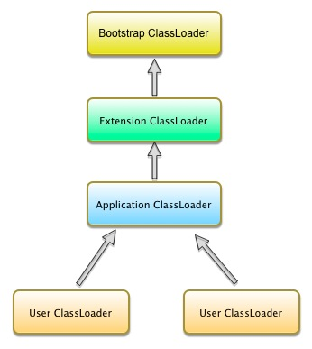
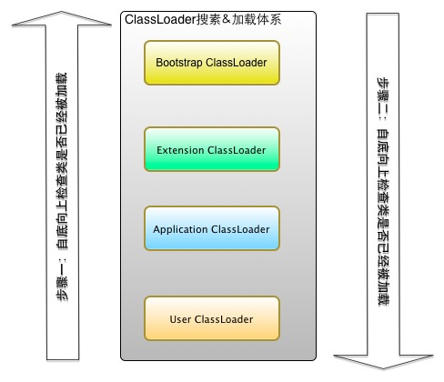

# Java ClassLoader理解
###什么是ClassLoader
&emsp;&emsp;我们都知道，当我们写好一个JAVA程序后，不管是我们自己手动通过javac编译，还是通过IDE开发自动编译，我们写的.java文件会最终生成一堆.class文件。当JVM要执行我们所写的程序时，其实就是要解析并执行这些.class文件。  
&emsp;&emsp;首先JVM会找到程序的入口类，一般即拥有public static void main(String[] args)这个类，因为要执行main方法，所以要先要加载这个方法所在的.class文件，然后在后续过程中“按需加载”———加载main方法所在类的class文件时以及执行main方法过程所需要用到其他的class文件。这些class文件会通过JVM的ClassLoader加载到JVM内存并且在JVM的方法区中每一个加载的class文件会对应一个Class对象，这个Class对象实际上是某个class文件在JVM中一种runtime表现，它包含着某个class所有的元数据，并作为方法区这个类各种数据的访问入口。  
&emsp;&emsp;综上所述，class文件从读取(硬盘文件或者字节流、网络)进入到JVM的内存并创建对应的Class对象的过程称之为“类加载”，那么负责完成这个过程的工具就叫做“ClassLoader”。

###类和类加载器
&emsp;&emsp;虽然类加载器主要用于实现类的加载动作，但是它在应用程序运行时还有其他作用:对于任一个类，都需要由加载它的类加载器 + 这个类本身的完全限定名一起确定其在JVM中的唯一性。每一个类加载器实例都拥有一个独立的namespace,也就是要比较两个是否相等，必须是两个类由同一个类加载器加载，否则，即使两个类来源于同一个Class文件，被同一个JVM加载，如果加载它们的类加载器不同，这两个类也不相等。  
&emsp;&emsp;从周志明的《深入理解java虚拟》第二版得知，我们比较的“相等”，包括代表类的Class对象的equals()方法，isAssignableFrom()方法，isInstance()方法的返回结果，还包括使用intanceof关键词做对象所属关系判定等情况。

###ClassLoader种类
**JVM默认提供的ClassLoader:**  
**1. Bootstrap ClassLoader(启动类加载器)**  
&emsp;&emsp;这个类加载器负责将存放在$JAVA_HOME/lib目录中的，或者被—Xbootclasspath参数所指定的路径中的，并且是JVM识别的类库记载到JVM内存中。  
**2. Extension ClassLoader(扩展类加载器)**  
&emsp;&emsp;这个类加载器由sun.misc.Launcher$ExtClassLoader实现，它负责加载$JAVA_HOME/lib/ext目录中，或者被java.ext.dirs系统变量所指定的路径中的所有类库。  
**3.Applicaiton ClassLoader(应用程序类加载器)**  
&emsp;&emsp;这个类加载器由sun.misc.Launcher$AppClassLoader实现。这个类加载可以由ClassLoader的getSystemClassLoader()方法获得，所以这个类加载器也可以称为系统类加载器。它负责加载用户类路径即我们配置环境环境变量时CLASSPATH上所指定的类库，我们可以在应用程序中使用这个类加载器，如果我们在开发应用程序中没有自定义自己的类加载器，那么一般情况下这个就是程序默认的类加载器。  
ps:我们还可以自己继承java.lang.ClassLoader实现自己的ClassLoader，这个后面再介绍。
###ClassLoader加载机制
**双亲委派模型**  
&emsp;&emsp;在我们应用程序在实际启动和运行过程中，JVM是使用上面介绍的三种类加载器以及用户自定义的类加载器来相互配合使用进行加载的。这些类加载器的关系如下图:  
  
上图这种类加载器之间的层次关系叫做双亲委派模型(Parents Delegation Model).双亲委派模型除了顶层的Bootstrap ClassLoader以外，其余的ClassLoader都有自己的父类加载器。注意：这里类加载器之间的父子关系不是继承关系，而是以组合关系来实现的，即除顶层的BootStrap ClassLoader以外，其他的子ClassLoader都有一个属性parent引用指向上一个ClassLoader,我们可以看类ClassLoader的代码:  
```java   
public abstract class ClassLoader {
    // The parent class loader for delegation
    // Note: VM hardcoded the offset of this field, thus all new fields
    // must be added *after* it.
    private final ClassLoader parent;
    ...
 ```
 在继承ClassLoader类实现自己的自定义ClassLoader时，如果给parent属性赋值则默认是AppClassLoader,我们来看ClassLoader默认构造函数:
```java
  ...
  protected ClassLoader() {
        this(checkCreateClassLoader(), getSystemClassLoader());
    }
  ...
```
**使用双亲委派模型的类搜索&加载机制**  
&emsp;&emsp;当JVM请求某个ClassLoader实例使用这种模型来加载某个类时：首先检查该类是否已经被当前类加载器加载(看下面ClassLoader#loadClass()方法代码片段)，如果没有被加载，则先委托给她的父加载器加载即调用parent.loadClass()方法，这样一直请求调用到请求顶层类加载ClassLoader#findBootstrapClassOrNull(),如果这个方法依然加载不了，则会调用ClassLoader#findClass()方法，这个方法再找不到则会抛出ClassNotFoundException异常，但是这里的异常会被捕获,然后返回给委托发起者，最后由当前类加载器的findClass()方法类加载类，如果找不到则抛出ClassNotFoundException异常
```java
  ...
  protected Class<?> loadClass(String name, boolean resolve)
        throws ClassNotFoundException
    {
        synchronized (getClassLoadingLock(name)) {
            //首先检查class是否已经被加载
            Class c = findLoadedClass(name);
            if (c == null) {
                long t0 = System.nanoTime();
                try {
                    //如果class没有被加载且已经设置parent,那么请求其父加载器加载
                    if (parent != null) {
                        /**
                         *注意当这里调用parent.loadClass()方法找不到Class时会抛出ClassNotFoundException异常，但是该异常是被捕获的
                         */
                        c = parent.loadClass(name, false);
                    } else {
                      //如果没有设定parent类加载器，则寻找BootstrapClss并尝试使用Boot loader加载
                        c = findBootstrapClassOrNull(name);
                    }
                } catch (ClassNotFoundException e) {
                    // ClassNotFoundException thrown if class not found
                    // from the non-null parent class loader
                }

                /**
                 *如果当前这个loader所有的父加载器以及顶层的Bootstrap ClassLoader都不能加载待加载的类
                 *那么则调用自己的findClass()方法来加载
                 */                
                if (c == null) {
                    // If still not found, then invoke findClass in order
                    // to find the class.
                    long t1 = System.nanoTime();
                    c = findClass(name);

                    // this is the defining class loader; record the stats
                    sun.misc.PerfCounter.getParentDelegationTime().addTime(t1 - t0);
                    sun.misc.PerfCounter.getFindClassTime().addElapsedTimeFrom(t1);
                    sun.misc.PerfCounter.getFindClasses().increment();
                }
            }
            if (resolve) {
                resolveClass(c);
            }
            return c;
        }
    }
    
    //该方法实现默认是抛出异常，需要用户自己实现
    protected Class<?> findClass(String name) throws ClassNotFoundException {
        throw new ClassNotFoundException(name);
    }
  ...
```  
上面说的比较啰嗦，其实简单点，JVM类加载器的步骤模型为：    
1.先检查需要加载的类是否已经被加载，这个过程是从下-------> 上;  
2.如果没有被加载，则委托父加载器加载，如果加载不了再由自己加载，这个过程是从上 ------> 下;   
  
**为什么要使用双亲委托模型?**  
&emsp;&emsp;使用双亲委派模型，我们可以看到在加载过程中都是以“父”为优先加载的，这样就可以避免类的重复加载，当父加载器加载后，所有的子加载器是共享这个父加载器加载的所有Class。同时考虑到安全性，如果不使用这种委托模型，那么我们可以随时使用自定义的java.lang.Object类并放在程序的ClassPath中，那么应用程序中将会出现一片混乱。
###自定义ClassLoader
**为什么我们需要自定义类加载?**  
主要有两个原因:  
1.需要加载外部的class。JVM提供的默认ClassLoader只能加载指定目录下的.jar和.class,如果我们想加载其他位置的class或者jar时，这些默认的类加载器是加载不到的((如果是文件格式必须配置到classpath))。例如:我们要加载网络上一个class字节流。  
2.需要实现class的隔离性。目前我们常用的web服务器，如tomcat,jetty都实现了自己定义的类加载，这些类加载器主要完成以下三个功能:   
- 实现加载web应用指定目录下的jar和class
- 实现部署在容器中的web应用程序共同使用的类库的共享
- 实现部署在容器中各个web应用程序自己私有类库的相互隔离   

**如何定义自己的类加载器?**  
1.继承java.lang.ClassLoader  
2.覆写父类的findClass()方法
