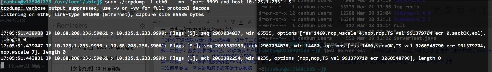

#TCP连接三次握手学习和理解
###需要理解的概念名词
- **Berkeley套接字（也称为BSD套接字):**一个应用程序接口（API），使用一个Internet套接字的概念，使主机间或者一台计算机上的进程间可以通讯。 它可以在很多不同的输入/输出设备和驱动之上运行，尽管这有赖于操作系统的具体实现。 接口实现用于TCP/IP协议，因此它是维持Internet的基本技术之一。 它是由加利福尼亚的伯克利大学开发，最初用于Unix系统。 如今，所有的现代操作系统都有一些源于Berkeley套接字接口的实现，它已成为连接Internet的标准接口  
- **位码,即tcp标志位,有6种标示:**  
SYN :synchronous建立联机  
ACK :acknowledgement 确认   
PSH :push传送   
FIN :finish结束   
RST :reset重置   
URG :urgent紧急  
Sequence number :顺序号码  
Acknowledge number :确认号码

###tcp是如何建立的
**TCP三次握手建立连接**  
 TCP为了通信双方确认建立起连接，设计了三次握手的策略，三次握手的过程如下:  
第一次握手：客户端发送syn包(syn = j） 到服务器，并进入SYN_SEND状态，等待服务器确认  
第二次握手：服务器收到syn包，必须确认客户端发过来的SYN，这个时候ack = j + 1 ,同时自己也发送一个SYN包(syn = k),这个时候服务器总共向服务端发送syn = k ack = j +1，此时服务器进入SYN_RECV状态  
第三次握手：客户端收到服务器的SYN和ACK包，向服务器发送确认包ACK(ack = k+1), 此包发送完毕，客户端和服务端进入ESTABLISHED状态.  
**三次握手完成，客户端和服务端开始传送数据**   

**以下是实例分析:**   

Client IP： 10.68.208.236  
Server IP:   10.125.1.233  
**第一次握手(17:05:51.438988) :** 10.68.208.236 发送syn ,seq number = 2907034837 的数据包到 10.125.1.233，由SYN知道10.68.208.236要求联机     
**第二次握手(17.05.51.439047):**  10.125.1.233 收到请求后要确认联机请求，向10.68.208.236发送ack number = 2907034837 +1 =2907034838, 随机产生seq number = 2063382253  
**第三次握手(17.05.51.443831):** 10.68.208.236 收到后检查ack number是否正确，即ack number是否等于第一次发送的 seq number +1 ,若正确，10.68.208.236会再发送ack number= 2063382253 + 1 =2063382254，10.125.1.233收到确认ack number是否等于 第二次发送的seq +1则连接建立成功

**未连接队列**  
在三次握手协议中，服务器维着一个未连接队列，该队列为每个客户端SYN包(SYN=J)开设一个条目，该条目表明服务器已经收到SYN包，并向客户端发出确认，并正在等待客户端确认包。这些条目所标识的连接在服务端处于SYN_RECV状态，当服务器接收到客户端的确认包时，删除该条目，服务器进入ESTABLISGED状态。  
backlog参数：表示未连接队列的最大容纳数目  
SYN-ACK重传次数：服务器发送SYN-ACK包，如果未收到客户端的确认包，服务器进行首次重传，等待一段时间仍未收到客户端确认包，进行第二次重传，如果重传次数超过系统规定的最大重传次数，系统将该连接信息从半连接队列中删除  
***注意：每次重传等待的时间不一定相同
半连接存活时间：是指半连接队列的条目存活的最大时间，也就是服务器从收到客户端SYN包到确认这个报文无效的最大时间，该时间值是所有重传请求包的最大等待时间总和。有时候我们也称为半连接存活时间为timeout时间、SYN_RECV存活时间***