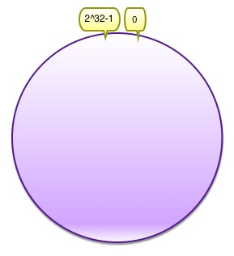
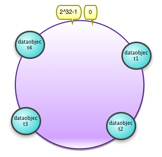
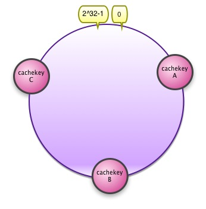
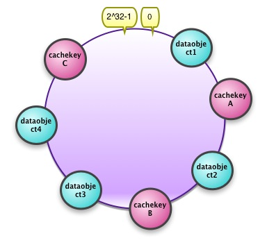
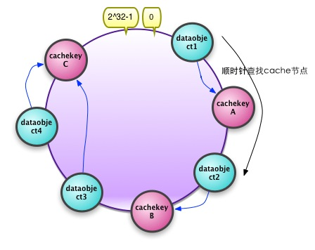

#一致性hash算法的理解

####哈希算法
######哈希算法应该满足的几个条件：平衡性、单调性、分散性:
- 平衡性: 是指hash的结果应该平均分配到各个节点，这样从算法上就解决了负载均衡问题
- 单调性: 是指在新增或者删减节点时,同一个key访问的值总是一样的
- 分散性: 是指数据应该分散的存放在分布式集群中的各个节点(节点自己可以有备份)，不必要每个节点都存储所有的数据  

#####典型的应用场景：
有N台服务器提供缓存服务，需要对服务器进行负载均衡，将请求平均分发到每台服务器上，每台机器负责1/N的服务。常用的的算法：  
**假设要存放的对象的键值为key,对hash结果取余数(hash(key) mode N)**  
按照自定义的hash算法，对每个请求的hash值按N取模，得到余数i,然后将请求分发到编号为i的机器。但是这种算法存在致命的问题:  
1. 如果某一台机器宕机，那么应该在该机器上的请求就无法得到正确的处理，这时需要将挂掉的服务器从算法中去除，这个时候就会有(N-1)/N的服务器的缓存数据需要重新进行计算  
2. 如果新增一台机器，就会有N/(N+1)的服务器的缓存数据需要进行重新计算。  
**引发的问题:**    
对于系统而言1,2的问题都会导致大量缓存的失效或者数据转移，这意味着导致上层应用程序访问此区域的缓存时缓存不可用，这样可能会到来RT会慢，或者后者后端DB负载过重甚至可能被压垮。那么如何设计一个负载均衡策略，使得受到的影响尽可能的少呢？

####一致性hash的基本思想
将需要存放的数据对象和cache服务器的节点都映射到同一个hash 数值空间中，并且使用相同的hash算法，这样当新增或者移除一个cache服务器节点时，它能够尽可能小的改变已存在key映射关系，尽可能的满足单调性的要求
####一致性hash的讲解
#####一、环形hash空间
一般通常的hash算法都是将value映射到一个0~2^32-1的数值空间，所以我们可以把这个空间想象成一个首尾相接的原型，这个圆的开始点是0，结束点是 2^32-1,如下图所示：
  

####二、把要存放的对象映射到hash空间
假设我们要把4个数据对象dataobject1~dataobject4映射到hash空间，通过hash函数计算出的hash值key在环上的分布图所下：    
hash(dataobject1) = datakey1;  
hash(dataobject2) = datakey2;  
hash(dataobject3) = datakey3;  
hash(dataonject4) = datakey4;  

####三、把cache server的节点映射到hash空间
假设我们有A,B,C三台cache server，把cache server的IP通过hash函数计算出的hash值key在环上的分布如下图所示：  
hash(cacheA) = cachekeyA;  
hash(cacheB) = cachekeyB;  
hash(cacheC) = cachekeyC;  

####四、把要存放的数据对象映射到cache Server
通过上面步骤二和步骤三，我们把数据对象和cache Server节点通过同一个hash算法都映射到hash数值空间中了，接下来我们要考虑如何把数据对象映射到cache Server的节点上面，如下图所示：  
  
**映射过程为：**  
 假设数据对象hash(dataobject) = datakey,从datakey这个数值开始，顺时针沿着环形数值空间查找，遇到的第一个cachekey,那么这个数据对象就存储在cachekey对应的cache server节点上。因为数据对象和cache server使用的hash算法是同一个，且对于同一个数据对象和同一个cache server，他们的hash也是固定的，所以这个数据对象必然会找到唯一的一个cache server节点,如下图所示:
  
如上图所示：  
hash(dataobject1) =datakey1 ----->cacheKeyA;  
hash(dataobject2) =datakey2 ----->cacheKeyB;  
hash(dataobject3) =datakey3 ----->cacheKeyC;  
hash(dataobject4) =datakey4 ----->cacheKeyC;
 
####五、当cache server节点发生变动
#####移除一个cache server节点
 

#####新增一个cache server节点

###参考资料
[从头到尾彻底解析Hash表算法](http://blog.csdn.net/v_JULY_v/article/details/6256463)  
[一致性hash算法 - consistent hashing](http://blog.csdn.net/sparkliang/article/details/5279393)

